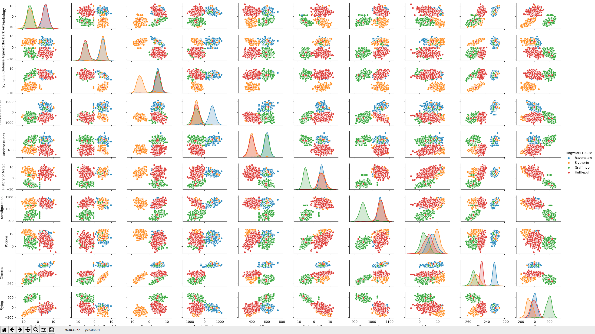

# DSLR

## About DSLR:

* DSLR is a machine learning project. The goal of this project is to do a logistic regression from scratch.

* DSLR is composed of six scripts, `describe.py`, `histogram.py`, `scatter_plot.py`, `pair_plot.py`, `logreg_train.py` and `logreg_predict.py`.

### About `describe.py`:

* `describe.py` is a reproduction of [pandas](https://pandas.pydata.org/) method appointed [describe](https://pandas.pydata.org/pandas-docs/stable/generated/pandas.DataFrame.describe.html).

* `describe.py` takes a csv as an argument and print describe (cout, std, mean, quantiles, max, min) in the standard output.

### About `histogram.py`:

* `histogram.py` uses [matplotlib](https://matplotlib.org/) to show histogram of features.

* I split all features in four arrays, according class, and plot them in histogram to show homogeneous or heterogeneous features 
like this: 

* thanks to `histogram.py` i found two homogeneous features (Arithmancy, Care of Magical Creatures).

### About `scatter_plot.py`:

* `scatter_plot.py` uses [matplotlib](https://matplotlib.org/) to show scatter plot of features.

* I split all features in four arrays, according class, and plot them in scatter plot to find similar features like this:

* thanks to `scatter_plot.py` i found two features which are similar (Astronomy, Defense Against the Dark Arts).

### About `pair_plot.py`:

* `pair_plot.py` uses [seaborn](https://seaborn.pydata.org/) to show a [pair_plot](https://seaborn.pydata.org/generated/seaborn.pairplot.html).

* `pair_plot.py` shows the final dataset to train and predict.

### About `logreg_train.py`:

* `logreg_train.py` trains thetas to predict class.

* It writes thetas in a file after trained them.

* `logreg_train.py` uses [gradient descent](https://en.wikipedia.org/wiki/Gradient_descent) to minimize cost function.

* I use [cross entropy](https://en.wikipedia.org/wiki/Cross_entropy) as cost function.

* `logreg_train.py` uses [sigmoid](https://en.wikipedia.org/wiki/Sigmoid_function) as hypothesis.

* `logreg_train.py` is a [One vs All Classifier](http://mlwiki.org/index.php/One-vs-All_Classification).

### About `logreg_predict.py`:

* `logreg_predict.py` uses file which contain trained thetas to predict class on new data. And writes predictions in a new file with index of students.

### About data:

* 'dataset_train.csv' has 1600 exemples, 17 features and one Y which is `Hogwarts House`.

* 'dataset_test.csv' has 400 exemples and 17 features.

### About `read_and_complete_data.py`:

* it's a function to read data, and replace NaN by mean of feature, delete usless features and scale data.

## What do you need to make DSLR work ?

* python >= 3.0

* [numpy](http://www.numpy.org/)

* [pandas](https://pandas.pydata.org/)

* [matplotlib](https://matplotlib.org/)

* [seaborn](https://seaborn.pydata.org/)

## Usage:

* `python3 describe.py AnyData.csv`

* `python3 histogram.py dataset_train.csv`

* `python3 scatter_plot.py dataset_train.csv`

* `python3 pair_plot.py dataset_train.csv`

* `python3 logreg_train.py dataset_train.csv`

* `python3 logreg_predict.py dataset_test.csv`
